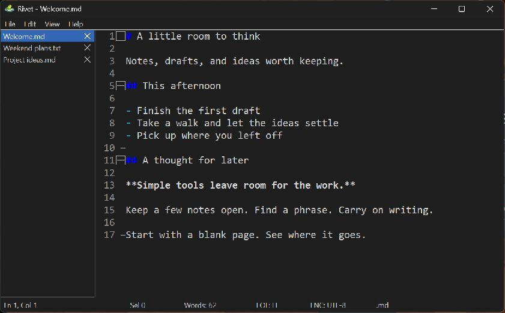
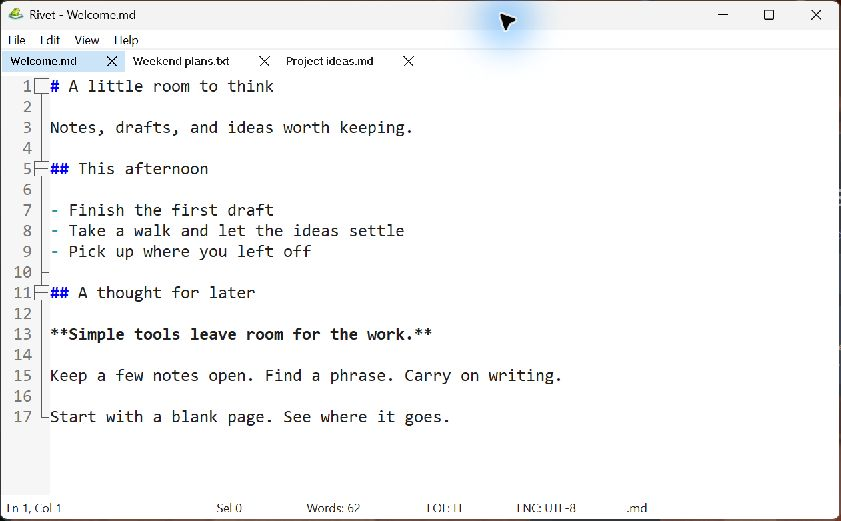

# Rivet

**A little room to think.**

A compact, native Windows editor for notes, drafts, and everyday text files.

[Download for Windows](https://github.com/mgelsinger/rivetnotes/releases/latest) · [User guide](docs/USAGE.md) · [Changelog](CHANGELOG.md) · [Report an issue](https://github.com/mgelsinger/rivetnotes/issues)

*Rivet 0.4.27, with sample notes. Native menus, vertical tabs, and Markdown highlighting.*

Rivet keeps the everyday things close: a few open notes, a quick search, a saved
session, and a place to pick up where you left off. It uses a native Win32
interface and the Scintilla editing engine, with a deliberately compact feature set.

See the light theme

Light and dark themes can be switched from the View menu. Tabs can sit at the
top, left, or right of the editor.

## Get Rivet

**[Download the latest release](https://github.com/mgelsinger/rivetnotes/releases/latest)** for Windows x64.

| Choose | Download | Getting started |
| --- | --- | --- |
| **Installer** | `rivet-<version>-setup.exe` | Install for your account or for all users. Includes Explorer integration and optional updates. |
| **Portable ZIP** | `rivet-<version>-win64-portable.zip` | Extract and run `rivet.exe`. No installation required. |

The ZIP uses AppData for settings and recovery by default. To keep everything
beside the executable, opt into a [self-contained portable profile](docs/USAGE.md#self-contained-portable-profiles).

Already using Rivet 0.4.23 or later? Open **Help > Check for updates**.
Earlier versions need one manual installation of a current release.

## What it does

| For your everyday work | In Rivet |
| --- | --- |
| **Keep several things open** | Tabs across the top or down either side, with a resizable vertical strip and remembered layout. |
| **Pick up where you left off** | Session restore, periodic recovery snapshots, and confirmation before closing an edited tab. |
| **Find the right words** | Find and replace, regular expressions, Find in Files, and Go to Line. |
| **Make the editor comfortable** | Light and dark themes, font selection, zoom, word wrap, and optional line numbers. |
| **Work with plain text and code** | Syntax highlighting for Markdown and common source/configuration formats, Markdown heading folding, and preserved text encodings. |
| **Handle the small jobs quickly** | F5 date/time insertion, case conversion, whitespace cleanup, recent files, and path-copy commands. |

### A spelling nudge

Misspelled words get a small underline in notes and Markdown prose. **Underlines
only: no suggestions, autocorrect, or changes to your text.** Spellcheck uses
installed Windows dictionaries and can be toggled in **View > Spellcheck**.

URLs, email addresses, and Markdown code are excluded. Source files and large
documents are normally skipped. See [spellcheck details](docs/USAGE.md#spellcheck)
for supported languages and limits.

### Updates on your terms

Automatic updates are **off by default**. Enable them from Help for background
checks and downloads, with progress in the existing status bar.

| Your installation | Update behavior |
| --- | --- |
| **For your account** | Can update quietly when you close Rivet. Choose **Restart to update** to reopen afterward. |
| **For all users** | Downloads in the background, then waits for an explicit restart with administrator approval. |
| **Portable ZIP** | Replace the executable manually, keeping your profile data. |

There is no separate updater window. Windows may still show its own security or
administrator prompts. Rivet verifies signed update metadata and the installer
hash before installation. [How updates work](docs/USAGE.md#optional-updates)

## Useful shortcuts

| Action | Shortcut |
| --- | --- |
| New / Open | `Ctrl+N` / `Ctrl+O` |
| Save / Save all | `Ctrl+S` / `Ctrl+Shift+S` |
| Close tab | `Ctrl+W` |
| Next / Previous tab | `Ctrl+Tab` / `Ctrl+Shift+Tab` |
| Cycle tab placement | `Ctrl+Alt+T` |
| Find / Replace | `Ctrl+F` / `Ctrl+H` |
| Find next / Previous | `F3` / `Shift+F3` |
| Go to line | `Ctrl+G` |
| Insert date/time | `F5` |
| Uppercase / Lowercase | `Ctrl+Shift+U` / `Ctrl+U` |
| Zoom in / Out / Reset | `Ctrl+=` / `Ctrl+-` / `Ctrl+0` |

## Project status and feedback

Rivet is a pre-1.0 project. The current focus is **stability, polish, and feedback
from everyday use**. The feature set is intentionally compact; the next steps
will be guided by how people use the editor over time.

Bug reports and practical suggestions are welcome in
[GitHub Issues](https://github.com/mgelsinger/rivetnotes/issues). For a bug, include
your Rivet version from **Help > About Rivet**, your Windows version, and the steps
to reproduce it. Use sample text when sharing a screenshot or a file.

Please discuss substantial feature additions before opening a pull request.
See [Contributing](CONTRIBUTING.md) for the workflow.

## Documentation and development

- [User guide](docs/USAGE.md): spelling, updates, portable profiles, and data locations.
- [Development guide](docs/DEVELOPMENT.md): building from source and running checks.
- [Architecture](docs/ARCHITECTURE.md): how the editor is organized.
- [Manual QA checklist](docs/QA-CHECKLIST.md): interactive checks alongside automated tests.
- [Changelog](CHANGELOG.md): release history.

CI checks formatting, linting, tests, and dependency advisories. Release builds
also test per-user and system-wide installers. Automated coverage includes
saving and recovery, editor preferences, dialog behavior, and update verification;
visual and interactive behavior is covered by a separate manual QA checklist.

## License

[MIT](LICENSE). Third-party attribution is in [NOTICE.txt](NOTICE.txt) and
[THIRD_PARTY_NOTICES](THIRD_PARTY_NOTICES).
